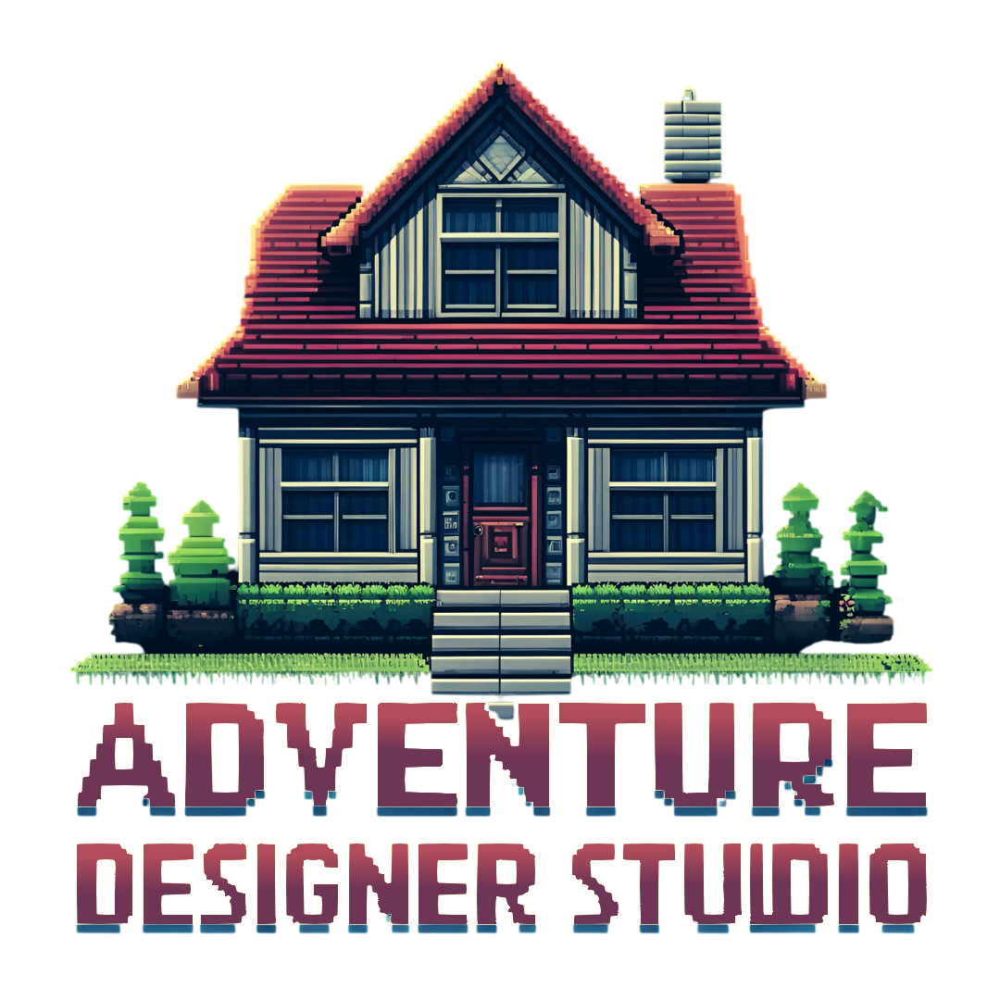

<p align="center"></p>

# Adventure Studio Designer

**Adventure Studio Designer** was born with the idea of giving life back to a type of game that was embraced by an entire generation, conversational adventures. Surely you remember adventures like the [Hobbit](https://bbcmicro.co.uk/jsbeeb/play.php?autoboot&disc=https://bbcmicro.co.uk/gameimg/discs/1681/Disc094-HobbitSTT.ssd&noseek), [Zork](https://es.wikipedia.org/wiki/Zork) or, in Spain, any of the text adventures created by the company [Aventuras AD](https://es.wikipedia.org/wiki/Aventuras_AD) like [La Aventura Original](https://es.wikipedia.org/wiki/La_Aventura_Original), [Jabato](https://es.wikipedia.org/w/index.php?title=Jabato_(videojuego)&action=edit&redlink=1) o [La Diosa de Cozumel](https://es.wikipedia.org/w/index.php?title=La_diosa_de_Cozumel&action=edit&redlink=1).

Nowadays, a small bunch of people around the world are still creating, playing and distributing this kind of game. In Spain,  the most significant public organisation is [CAAD](https://caad.club/), which provides news, support, forums and a distribution channel for those games.

I was one of those people who spent countless hours playing Text Adventures —also known in Spanish as "Aventuras Conversacionales". I believe that with today's technologies, we can breathe new life into a new genre called **Enhanced Conversational Adventures**. These modern versions could incorporate voice recognition and text-to-speech for accessibility, include video and animated scenes to enhance immersion, and even use Augmented Reality to bring adventures into the real world.

I strongly believe it's possible to empower anyone to create their own Text Adventure without needing any programming knowledge. By providing an intuitive Editor —where users only need to point, create, connect, and compile— we can make game creation accessible to everyone.

Imagine a teacher using such a tool to build a short adventure that re-creates the French Revolution. With no coding skills required, students could explore the events as participants, gaining a deeper understanding of history by experiencing it interactively— even exploring alternate outcomes, like preventing the revolution entirely.

## Getting Started

### Prerequisites

- **C++ Compiler**: GCC 11+ or Clang 14+ (C++23 support required)
- **CMake**: Version 3.21 or higher
- **Git**: For cloning the repository and vcpkg
- **vcpkg**: Package manager for C++ libraries
- **System Build Tools**: Required by vcpkg to build certain dependencies

### How to Install Prerequisites

<details>
<summary><strong>Linux (Debian/Ubuntu)</strong></summary>

**1. Install C++ Compiler and Build Tools:**
```bash
sudo apt update
sudo apt install build-essential autoconf automake libtool pkg-config python3-jinja2
```
This installs GCC, G++, Make, and other essential build tools.

**2. Install CMake:**
```bash
sudo apt install cmake
```
If you need a newer version (3.21+), use the official Kitware repository:
```bash
sudo apt install software-properties-common
wget -O - https://apt.kitware.com/keys/kitware-archive-latest.asc | sudo apt-key add -
sudo apt-add-repository 'deb https://apt.kitware.com/ubuntu/ focal main'
sudo apt update
sudo apt install cmake
```

**3. Install Git:**
```bash
sudo apt install git
```

**4. Verify installations:**
```bash
g++ --version      # Should show GCC 11+
cmake --version    # Should show 3.21+
git --version
```

</details>

<details>
<summary><strong>Linux (Fedora/RHEL)</strong></summary>

**1. Install C++ Compiler and Build Tools:**
```bash
sudo dnf install gcc-c++ autoconf automake libtool pkgconfig python3-jinja2
```

**2. Install CMake:**
```bash
sudo dnf install cmake
```

**3. Install Git:**
```bash
sudo dnf install git
```

**4. Verify installations:**
```bash
g++ --version      # Should show GCC 11+
cmake --version    # Should show 3.21+
git --version
```

</details>

<details>
<summary><strong>macOS</strong></summary>

**1. Install Xcode Command Line Tools (includes Clang compiler):**
```bash
xcode-select --install
```

**2. Install Homebrew (if not already installed):**
```bash
/bin/bash -c "$(curl -fsSL https://raw.githubusercontent.com/Homebrew/install/HEAD/install.sh)"
```

**3. Install CMake and Build Tools:**
```bash
brew install cmake autoconf automake libtool pkg-config
pip3 install jinja2
```

**4. Install Git (if not included with Xcode tools):**
```bash
brew install git
```

**5. Verify installations:**
```bash
clang++ --version  # Should show Clang 14+
cmake --version    # Should show 3.21+
git --version
```

</details>

<details>
<summary><strong>Windows</strong></summary>

**1. Install Visual Studio Build Tools (C++ Compiler):**
- Download [Visual Studio Build Tools](https://visualstudio.microsoft.com/visual-cpp-build-tools/)
- Run the installer and select **"Desktop development with C++"**
- This includes MSVC compiler and Windows SDK

**2. Install CMake:**
- Download the installer from [cmake.org/download](https://cmake.org/download/)
- Choose the **Windows x64 Installer (.msi)**
- **Important:** During installation, select **"Add CMake to the system PATH for all users"**

**3. Install Git:**
- Download from [git-scm.com](https://git-scm.com/download/win)
- Run the installer with default options
- **Recommended:** Select "Git from the command line and also from 3rd-party software"

**4. Restart your terminal** (Command Prompt or PowerShell) after all installations

**5. Verify installations:**

From a regular Command Prompt or PowerShell:
```batch
cmake --version    REM Should show 3.21+
git --version
```

To verify the C++ compiler, use one of these methods:

*Option A:* Open **"Developer Command Prompt for VS"** or **"Developer PowerShell for VS"** from the Start Menu, then run:
```batch
cl
```
This should display Microsoft C/C++ compiler version info.

*Option B:* From a regular Command Prompt, run:
```batch
where /R "C:\Program Files\Microsoft Visual Studio" cl.exe
```
This should find the cl.exe compiler path if Visual Studio Build Tools is installed correctly.

*Option C:* Open **Visual Studio Installer** and verify that **"Desktop development with C++"** workload is installed.

</details>

### Quick Start

#### 1. Install vcpkg

vcpkg manages all project dependencies automatically. Install it system-wide:

**Linux/macOS:**
```bash
# Clone vcpkg to /opt
sudo git clone https://github.com/microsoft/vcpkg.git /opt/vcpkg

# Change ownership to your user
sudo chown -R $USER:$USER /opt/vcpkg

# Bootstrap vcpkg
cd /opt/vcpkg
./bootstrap-vcpkg.sh

# Set environment variable (add to ~/.bashrc or ~/.zshrc for persistence)
export VCPKG_ROOT=/opt/vcpkg
echo 'export VCPKG_ROOT=/opt/vcpkg' >> ~/.bashrc
```

**Windows:**
```powershell
# Clone vcpkg
git clone https://github.com/microsoft/vcpkg.git C:\vcpkg

# Bootstrap vcpkg
cd C:\vcpkg
.\bootstrap-vcpkg.bat 

# Set environment variable
setx VCPKG_ROOT "C:\vcpkg"
```

#### 2. Clone the Repository

```bash
git clone https://github.com/chernandezosma/Adventure-Designer-Studio.git
cd Adventure-Designer-Studio
git submodule update --init --recursive
```

#### 3. (Optional) Setup Reference Libraries

For code browsing in your IDE (not required for building):

```bash
./setup-reference-libs.sh
```

This clones imgui, nlohmann_json, and spdlog to `lib/` for reference only. The build uses vcpkg versions.

#### 4. Build the Project

**Linux/macOS:**
```bash
./build.sh           # Release build (default)
./build.sh Debug     # Debug build
./build.sh Test      # Test build with unit tests
```

**Windows:**
```batch
build.bat            REM Release build (default)
build.bat Debug      REM Debug build
build.bat Test       REM Test build
```

**Note:** The first build takes 10-20 minutes as vcpkg downloads and compiles all dependencies. Subsequent builds are much faster.

#### 5. Run the Application

**Linux/macOS:**
```bash
cd build
./Adventure_Designer_Studio
```

**Windows:**
```batch
cd build\Release
Adventure_Designer_Studio.exe
```

### Project Dependencies

Managed by vcpkg:
- **imgui** - Immediate mode GUI library (with SDL2 bindings and docking)
- **SDL2** - Graphics, windowing, and input
- **nlohmann-json** - JSON library
- **spdlog** - Fast C++ logging library
- **boost-uuid** - UUID generation
- **gtest** - Google Test framework

Git submodule:
- **IconFontCppHeaders** - Header-only icon font integration

### Build Troubleshooting

**"Cannot find vcpkg"**

*Linux/macOS:*
```bash
echo $VCPKG_ROOT  # Should print /opt/vcpkg
```
If empty, set it: `export VCPKG_ROOT=/opt/vcpkg`

*Windows:*
```batch
echo %VCPKG_ROOT%  REM Should print C:\vcpkg
```
If empty, set it: `setx VCPKG_ROOT "C:\vcpkg"` and restart your terminal.

**"cmake is not recognized" (Windows)**

CMake is not installed or not in PATH. Install CMake from [cmake.org/download](https://cmake.org/download/) and ensure you select **"Add CMake to the system PATH"** during installation. Restart your terminal after installation.

**CMake configuration fails**

*Linux/macOS:*
```bash
# Clean build and try again
rm -rf build
./build.sh
```

*Windows:*
```batch
REM Clean build and try again
rmdir /s /q build
build.bat
```

**Windows: Do I need Developer Command Prompt?**

No. You can run `build.bat` from a regular Command Prompt or PowerShell. CMake automatically detects Visual Studio Build Tools. Just ensure:
1. CMake is in your PATH
2. Visual Studio Build Tools with "Desktop development with C++" is installed

**For detailed migration information**, see [VCPKG_MIGRATION.md](./VCPKG_MIGRATION.md) and [LIBRARY_SETUP.md](./LIBRARY_SETUP.md).

## How to achieve that

I'm an everyday person—a husband, father, grandfather, and lifelong technology enthusiast. I’m fully aware that I don’t have much free time to dedicate to full-time development, but I’m committed to making steady progress and will do my best to deliver new features as often as possible.

The **Adventure Designer Studio** will consist of three main components: the **Editor**, the **Compiler**, and the **Emulator**.

### Editor

This is the cornerstone of the system—a powerful yet user-friendly tool that allows users to build an entire game without writing a single line of code.

The Editor will feature a comprehensive control panel where users can create everything from objects to full scenes, which make up the game map. Within each scene, users will be able to assign images, triggers, objects, and more. They will also be able to define triggers and actions for objects, enabling rich interactivity among the game elements.

Additionally, the Editor will allow users to define the game’s lexicon—verbs, objects, adjectives, synonyms, etc.—enabling players to interact using typed phrases.

Users will also be able to define NPCs (Non-Player Characters), who can interact with the player by offering tips, objects, or puzzles to solve. In the future, NPCs could be enhanced with AI or even replaced with real players in a multiplayer setting.

### Interpreter

This component is responsible for running the game without compiling it—ideal for development and testing. It will offer features like a debugger, custom starting points, and a variable dump window that displays the current objects and their states, triggers, actions, and more. These tools will help developers identify and fix issues during the development phase.

### Compiler

This is the lowest-level component in the system, responsible for generating a deployable product for 8-, 16-, 32-, and 64-bit machines, tailored to the specific characteristics of each platform.

It will also offer a web interface, allowing the game to be played on any device with a browser—providing a truly platform-independent experience.

As you might have guessed, not all features will be available right away, but I’ll work to implement them over time.

The project will be developed in **C++**, chosen for its stability, performance, and flexibility across platforms such as Linux, Windows, and macOS.

C++ also enables us to create specialized processes for compiling games for classic 8-bit platforms like the **ZX Spectrum**, **MSX**, **Commodore 64**, and **Amiga 500**, without losing focus on support for modern platforms.

For the web version, we’ll likely use **React** and **React Native** as the core libraries to run the game on both web and mobile platforms.

The persistence layer will manage data using either a **JSON file** or an **SQLite database**, automatically switching to SQLite if the data grows too large. This approach keeps the project compact and lightweight, minimizing its footprint on any system where it’s run or compiled.

A **Dockerized version** will likely be available for web servers, supporting a “download-and-play” philosophy while keeping the application isolated from the host system and ensuring no modifications are made outside its container.

To achieve some features, I may rely on public libraries or occasionally use other programming languages—but always with the same goal in mind: to deliver a solid, easy-to-use product.

## Key Features:

**Multilingual Support:**

- The **Adventure Designer Studio** will support **i18n**, meaning it will offer a multilingual interface for both the Editor and the game itself. This allows developers to work and players to enjoy the game without language barriers.

- This i18n support will include a **Natural Language Processing Engine (NPLE)** to ensure your stories can be played in multiple languages and reach a wider audience, free from language limitations.

**Import from Popular Engines:**

- Seamlessly import projects from well-known engines like PQWS and DAAD. This capability ensures that you can continue your existing projects within Adventure Studio Designer without losing any progress, providing a smooth transition and enhanced workflow.

**Editor:**

- Seamlessly import projects from well-known engines like **PQWS**, **PAWNS**, **Inform7**, **Aventuron**, **DAAD**, and **readyDAAD**. This capability ensures you can continue your existing projects within **Adventure Designer Studio** without losing any progress, providing a smooth transition and enhanced workflow.

- Each importer will be implemented as a plugin, which can be loaded or unloaded at the user’s discretion.

**Compiler and Interpreter:**

- Adventure Studio Designer will include a robust compiler and interpreter, enabling real-time testing and execution of your adventures. (see interpreter section in this README.md)


**Cross-Platform Compatibility:**

- You can create Adventures that run seamlessly across multiple platforms thanks to the integrated compiler.

- A versatile **Interpreter** lets you run and preview the game exactly as it will appear on the target platform. To achieve this, we will leverage existing emulators to execute the code.

### Rich Media Integration

- Enhance your adventures with rich media elements, including images, sound, and animations. Adventure Designer Studio will support a wide range of current media formats, allowing you to create a more immersive and engaging experience for players.

- The supported formats will be converted by the **Adventure Designer Studio Compiler** into media elements compatible with the target platform.

### New Technologies for Classic Games

- Integrate new technologies such as text-to-speech and speech-to-text, video playback, **Natural Language Processing**, Augmented Reality, AI, and more. These innovations are the core proposals of this project, breathing new life into this often neglected genre of games.

**Community and Support**

- You can contribute your games, ideas, and any other resources to the project. All contributions are welcome, and participation is completely free.

- We encourage an open and inclusive community where everyone’s voice matters. Whether you’re a developer, designer, storyteller, or player, your input helps shape the future of **Adventure Designer Studio**.

- Comprehensive documentation, tutorials, and forums will be available to support users at all levels.

- Regular updates and community events will foster collaboration, learning, and sharing among users worldwide.

- Together, we aim to build not just a tool, but a vibrant ecosystem where creativity and innovation thrive.

**Adventure Studio Designer** is more than just a tool; it's a gateway to endless possibilities in interactive storytelling. Whether you will craft a simple text-based adventure or a complex, branching narrative, **Adventure Studio Designer** provides the tools and support you need to turn your vision into reality. Dive into the world of conversational adventures and start creating today!

## Contributing

Thank you very much for considering contributing to the Adventure Studio Designer! Everyone will be welcome, you just need to write to [cayetano.hernandez.osma@gmail.com](mailto:cayetano.hernandez.osma@gmail.com) and tell us how you can and why you want to collaborate with the project.

We would greatly appreciate it if you could follow the [Convenital Commits guide](https://www.conventionalcommits.org/en/v1.0.0/) when committing your code to the repository. It helps us keep a clean, consistent commit history and enables automatic changelog generation.

We suggest to use the following ones:   
- **feat**: a new feature  
- **fix**: a bug fix
- **docs**: documentation only changes
- **style**: formatting, missing semi colons, etc
- **refactor**: code change that neither fixes a bug nor adds a feature
- **perf**: a code change that improves performance
- **test**: adding missing tests
- **chore**: changes to the build process or auxiliary tools
- **ci**: continuous integration-related changes

## Code of Conduct

In order to ensure that the Adventure Studio Designer community is welcoming to all, please review and abide by the Code of Conduct.

## Security Vulnerabilities

If you discover a security vulnerability or a security tread, please send an e-mail to Adventure Studio Designer via [cayetano.hernandez.osma@gmail.com](mailto:cayetano.hernandez.osma@gmail.com). All security vulnerabilities will be promptly addressed.

## License

The Adventure Designer Studio is open-source software licensed under the [GNU General Public License version 3 (GPL v3)](https://opensource.org/license/gpl-3-0).  
See [LICENSE.md](./LICENSE.md) for the full license text including the additional attribution requirement.
